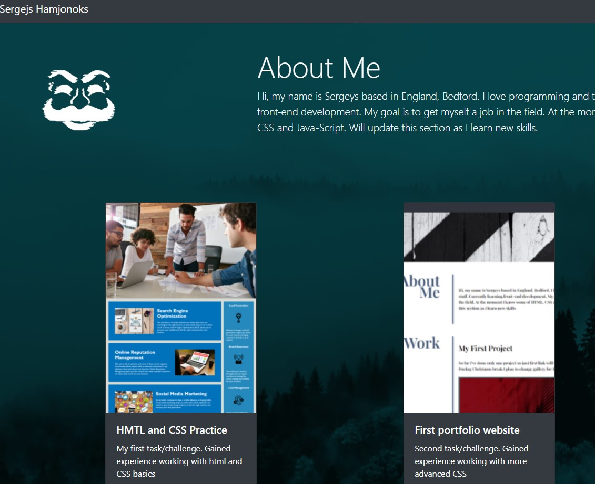

# Porftolio Website using Bootstrap

Created by &copy;Sergejs Hamjonoks.

## Project Description

Porftolio website created using mostly Bootstrap which was customised. I've learned some  
new things about CSS doing this Project.


## Screenshots




## Demo

https://heretotroll.github.io/Bootstrap-Portfolio/

## Technologies used

HTML along with CSS and Bootstrap framework


## License

[MIT](https://choosealicense.com/licenses/mit/)

## Installation

Install Challenge1 with Git Bash

1.Open Git Bash.  
2.Change the current working directory to the location where you want the project to be installed.


```bash
  cd DesiredProjectLocation
  git clone https://github.com/HereToTroll/Bootstrap-Portfolio.git
```
    